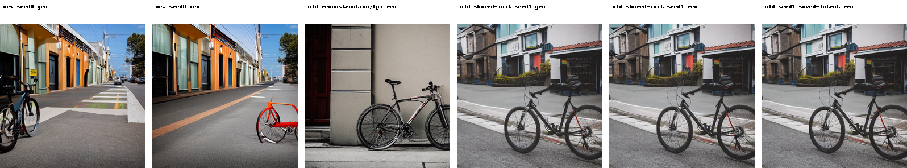

# run.py sample 0 seed 0 FPI comparison

This directory contains images from a `run.py` smoke test and nearby historical
FPI outputs for visual comparison.

## New run

Command:

```bash
cd /home/yzeng/remote/skip_inv/src
source ~/anaconda3/etc/profile.d/conda.sh
conda activate afpi
python run.py \
  --sample_ids 0 \
  --seed 0 \
  --method fpi \
  --guidance_scale 7 \
  --num_of_ddim_steps 50 \
  --max_iterations 1 \
  --source_init_prefix ../artifacts/outputs/aidi_gs7_seed \
  --output ../artifacts/outputs/run_py_first_prompt_seed0_fpi_test_bounded1
```

`--max_iterations 1` was used because the original unbounded FPI loop did not
finish in a practical amount of time during this test. The default behavior is
unchanged when `--max_iterations` is omitted.

The seed-0 initial latent file used by `run.py` was created at:

```text
../artifacts/outputs/aidi_gs7_seed0/init_latents.pt
```

## Images



- `new_run_seed0_sample0_gen.png`: generated image from the new `run.py` test.
- `new_run_seed0_sample0_rec.png`: reconstructed image from the new `run.py` test.
- `historical_reconstruction_fpi_sample0_rec.png`: historical `artifacts/outputs/reconstruction/fpi/0rec.png`.
- `historical_fpi_gs7_shared_init_seed1_sample0_gen.png`: historical shared-init seed1 generated image.
- `historical_fpi_gs7_shared_init_seed1_sample0_rec.png`: historical shared-init seed1 reconstructed image.
- `historical_fpi_gs7_seed1_from_saved_latents_sample0_rec.png`: historical saved-latent seed1 FPI reconstruction.

No historical FPI output with a `seed0` directory name was found under
`../artifacts/outputs`.
